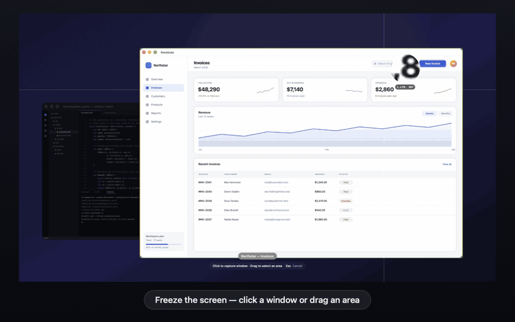
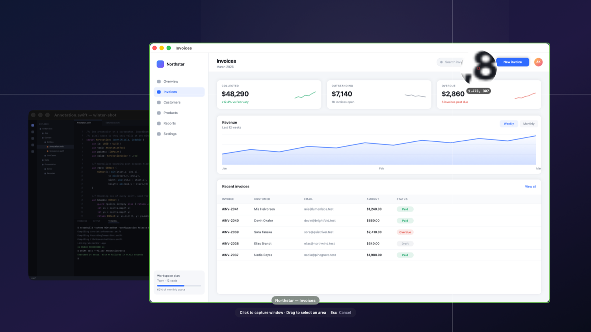
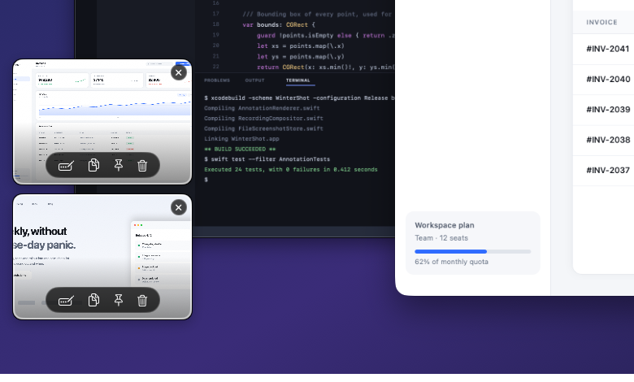
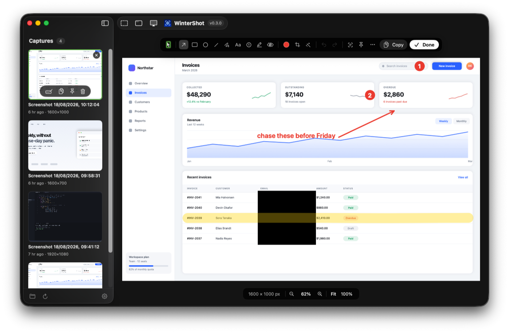
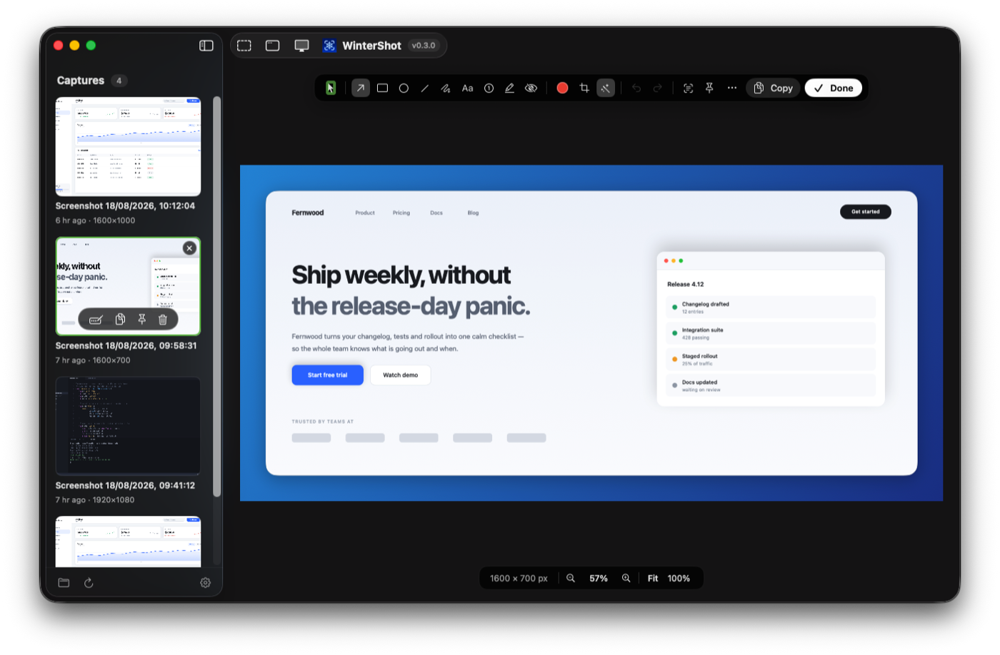
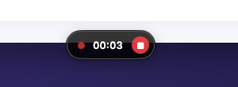
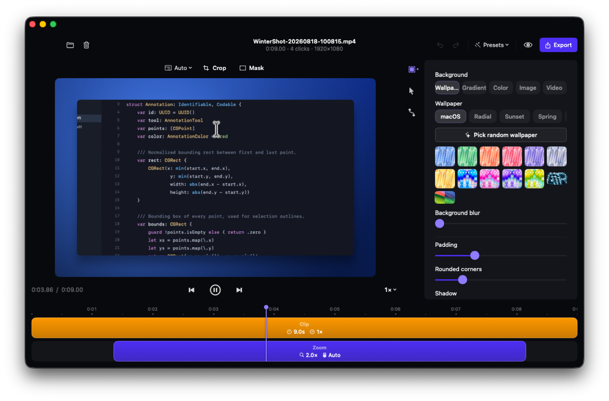
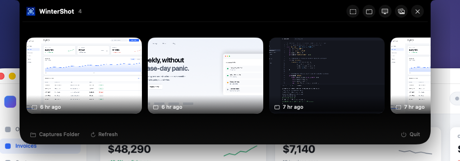

<div align="center">


# WinterShot

**Free, open-source screenshots and screen recording for macOS — capture, annotate, beautify, ship. 100% on-device.**

Press ⌘⇧4. Click a window or drag an area. Annotate it, drop it on a gradient, paste it anywhere — no account, no subscription, nothing ever leaves your Mac.

🎬 **Records your screen too** — and opens it in a Screen Studio-style editor: a camera that zooms wherever you click, a smooth synthetic cursor, wallpaper backdrops, and a 60 fps MP4 out the other end. [See it →](#-screen-recording--the-studio-editor)

[**⬇️ Download for Mac (.dmg)**](https://github.com/winterzxzz/winter_shot/releases/latest)

[](https://github.com/winterzxzz/winter_shot/releases/latest)
[](https://github.com/winterzxzz/winter_shot/releases)
[](https://github.com/winterzxzz/winter_shot/releases/latest)
[](https://github.com/winterzxzz/winter_shot/releases/latest)
[](WinterShot)
[](WinterShot)
[](#-privacy-by-design)
[](LICENSE)
[](https://github.com/winterzxzz/winter_shot/stargazers)



</div>

---

## What is WinterShot?

WinterShot is a **native macOS menu-bar app for screenshots and screen recordings**. It captures with ScreenCaptureKit, hands you a real editor — nine annotation tools, crop, background beautify, on-device OCR — and keeps every edit in a sidecar file so you can reopen a shot months later and still move that arrow.

Recordings get the same treatment: WinterShot logs your pointer and clicks *next to* the video instead of burning them in, then a Screen Studio-style editor turns the raw capture into a polished clip — zoom that follows your clicks, a synthetic cursor, backdrops, motion blur — and re-exports it any way you like, as many times as you like.

It's the free, private alternative to paid capture tools: pure SwiftUI, zero third-party dependencies, no telemetry, no account, and exactly **one** system permission.

## ⬇️ Download

**[Grab the latest `.dmg` from Releases →](https://github.com/winterzxzz/winter_shot/releases/latest)**

1. Open `WinterShot-v*.dmg` and drag **WinterShot** into **Applications**.
2. First launch: the build isn't notarized yet, so macOS may refuse to open it. Either **right-click → Open → Open**, or run:

   ```sh
   xattr -cr /Applications/WinterShot.app
   ```

3. Follow the two-step onboarding: pick your capture shortcut and grant **Screen Recording** (System Settings → Privacy & Security → Screen Recording). macOS may ask you to quit and reopen the app once.
4. WinterShot lives in the menu bar — no Dock icon. Press ⌘⇧4 and start capturing.

> If macOS's own ⌘⇧4 is still enabled, both will fire. Turn the system one off in System Settings → Keyboard → Keyboard Shortcuts → Screenshots, or record a different shortcut in WinterShot's Settings.

> Building from source instead? See [docs/DEVELOPMENT.md](docs/DEVELOPMENT.md).

## ✨ Features

| | |
|---|---|
| 🧊 **Frozen-screen selector** | The screen freezes the moment you press the hotkey. A pixel loupe with live coordinates follows the cursor, and windows lift out of a dimmed backdrop as you hover — one click captures a window cleanly, even when it's half-covered. |
| ✏️ **Nine annotation tools** | Arrow, rectangle, ellipse, line, freehand, text, numbered counters, highlighter and redaction — with a color row, adjustable stroke, undo/redo and drag-to-move. |
| ♻️ **Non-destructive by design** | Annotations, crop and backdrop live in a `.wshot.json` sidecar next to the PNG. Reopen a capture later and every arrow is still editable, every crop reversible. Pixels are flattened only on export. |
| 🎬 **Screen recording + studio editor** | Record a display, a window or an area. The raw video stays untouched while zoom, cursor, backdrop and masks are applied at export — re-export the same take with a different look anytime. |
| 🎨 **Background beautify** | Drop a shot onto a gradient with padding, rounded corners and a soft shadow — seven presets, live in the editor, ready for posts and docs. |
| 🔍 **On-device OCR** | Pull the text out of any capture with Apple Vision and copy it. Nothing is uploaded. |
| 📌 **Pin to screen** | Float a capture above every window while you work; drag to move, double-click to dismiss. |
| 🗂 **Capture history** | Your whole library sits beside the editor in the main window, and a notch panel drops from the top of the screen with the latest captures — reopen, copy, pin or delete from either. |
| ⌨️ **One global hotkey** | ⌘⇧4 opens the selector system-wide, and it's re-recordable in Settings. Everything else lives in the menu-bar icon. |
| 🚀 **Starts with your Mac** | Turn on *Open at login* in Settings and the menu-bar icon — and your capture shortcut — are waiting after every restart. |
| 🔒 **One permission, zero telemetry** | Screen Recording — and that's it. No microphone, no accessibility, no analytics, and no network traffic beyond the update check. |

## 📸 The capture flow

Press the hotkey and the screen freezes. Hover a window to lift it out of the dimmed backdrop and click to capture it whole, or drag anywhere to take an area — the loupe magnifies pixel-by-pixel with a live coordinate readout while you aim.

<p align="center"></p>

Every capture slides in as a thumbnail card at the edge of the screen — annotate, copy, pin or delete it right there, or click it to open the editor. New captures stack upward.

<p align="center"></p>

## 🎨 The editor

Nine tools, a live canvas, and a library sidebar. Nothing is baked into the image — the arrows, the counters, the crop and the backdrop are all still yours the next time you open the file.

<p align="center"></p>

Flip on a backdrop and the same capture is post-ready: gradient, padding, rounded corners, soft shadow.

<p align="center"></p>

## 🎬 Screen recording — the studio editor

Pick **Record Screen** from the menu bar, choose a display, a window or an area, and a floating timer pill tracks the take with a stop button. WinterShot keeps the real pointer *out* of the pixels and logs its motion, its clicks and even which pointer macOS was showing into a `.wsrec.json` sidecar.

<p align="center"></p>

Stop, and the studio editor opens:

<p align="center"></p>

- **Backdrops** — wallpaper, gradient, solid color, your own image, or a looping video, with blur, padding, corner radius and shadow.
- **Auto-zoom camera** — glides to wherever you clicked, holds while you work there, then eases back out. Adjustable depth.
- **Synthetic cursor** — smoothed, resizable, with click ripples, mirroring the pointer the app was actually showing (text cursor, hand, resize arrows…) in macOS, light or dark coloring.
- **Crop and masks** — a non-destructive crop with aspect lock, plus timed regions that blur sensitive data or spotlight one area of the frame.
- **Output shapes** — 16:9 for YouTube, 9:16 for Reels and TikTok, 1:1, 4:5 and more.
- **Finishing touches** — cinematic motion blur, background music with volume control, presets, undo/redo and a scrubable timeline.

Everything composites on the GPU, so the live preview *is* the 60 fps MP4 you export. The raw recording is never modified.

## 🗂 Your captures, one click away

The menu-bar icon drops a notch panel with your latest captures; the main window keeps the full library beside the editor.

<p align="center"></p>

## 🐛 Made for bug reports, feedback and demos

Screenshots are how software teams talk to each other. WinterShot is built for that loop:

- **File a bug** — capture the window, circle the broken bit, redact the customer's email, paste straight into the issue.
- **Review a design** — numbered counters walk a designer through five changes in one image.
- **Write the docs** — beautified shots with consistent padding and corners, exported at the same size every time.
- **Ship the demo** — record the feature, let the camera zoom where you click, export 16:9 for the changelog and 9:16 for social from the same take.

Because the edits live in sidecars, you can reopen last month's screenshot, move one arrow, and re-export — instead of redoing the capture.

## 🔒 Privacy, by design

- **One permission.** Screen Recording. Nothing else — no microphone, no accessibility, no input monitoring.
- **Nothing leaves your Mac.** Captures, recordings, annotations and OCR are all processed on-device. The app talks to the network for exactly one thing: checking the GitHub releases feed for a newer version — and downloading that release if you choose to install it.
- **No telemetry, no account, no analytics.** There is nothing to sign in to.
- **Your files stay yours** — plain PNGs and MP4s in `~/Library/Application Support/WinterShot/Captures/`, next to readable JSON sidecars. Delete the app and your captures are still ordinary files.

## 💻 Requirements

- **macOS 14 (Sonoma) or later**
- **Apple Silicon** (M1/M2/M3/M4) — the released build is arm64
- Screen Recording permission (granted once, in onboarding)

## ❓ FAQ

<details>
<summary><b>Is WinterShot free?</b></summary>
Yes — free and open source under MIT. No subscription, no account, no trial limits.
</details>

<details>
<summary><b>How is this different from macOS's built-in ⌘⇧4?</b></summary>
The system tool takes the picture and stops there. WinterShot adds a frozen-screen selector with a pixel loupe and window lifting, a real annotation editor whose edits stay editable forever, background beautify, OCR, pinning, a searchable history — and screen recording with a full post-production editor.
</details>

<details>
<summary><b>macOS says the app "cannot be opened". What do I do?</b></summary>
The build isn't notarized yet. Right-click the app → <b>Open</b> → <b>Open</b>, or run <code>xattr -cr /Applications/WinterShot.app</code> once.
</details>

<details>
<summary><b>Where do my captures live?</b></summary>
<code>~/Library/Application Support/WinterShot/Captures/</code> — an immutable PNG or MP4 plus a JSON sidecar holding the metadata and your edits. Sidecars are flagged hidden so Finder shows only pictures and movies; press ⌘⇧. to reveal them.
</details>

<details>
<summary><b>Can I edit a capture again later?</b></summary>
Yes — that's the point of the sidecars. Reopen any capture from the history and every annotation is still selectable, the crop is still reversible, and the backdrop is still adjustable. Exports flatten a copy, never the original.
</details>

<details>
<summary><b>Does the recording editor change my original video?</b></summary>
Never. Zoom, cursor, backdrop, crop, masks and music are applied only when you export. Re-export the same take as many times as you want, in as many shapes as you want.
</details>

<details>
<summary><b>Why does the cursor look different in the exported video?</b></summary>
Because it isn't the recorded one. WinterShot keeps the real pointer out of the captured pixels and re-draws a smoothed synthetic cursor at export time — that's what lets it glide between positions, scale up, show click ripples and stay sharp at any zoom level.
</details>

<details>
<summary><b>Can I change the ⌘⇧4 shortcut?</b></summary>
Yes — Settings → Global Hotkey, then click the shortcut and record a new one (it must include ⌘, ⌥ or ⌃).
</details>

<details>
<summary><b>Does WinterShot start automatically at login?</b></summary>
Only if you ask it to: Settings → Startup → <b>Open at login</b>. It registers through <code>SMAppService</code>, so the entry shows up in System Settings → General → Login Items & Extensions and can be switched off from either place — the toggle in WinterShot always reflects what the system currently says. Worth turning on, since the app has no Dock icon and the hotkey does nothing until it's running.
</details>

<details>
<summary><b>Does it work on Intel Macs?</b></summary>
The published build is Apple Silicon only. Intel users can build from source — see <a href="docs/DEVELOPMENT.md">docs/DEVELOPMENT.md</a>.
</details>

## 🗺 Roadmap

- Space to toggle window/area mode mid-selection
- Multi-display fullscreen capture
- More export presets for the recording editor

## 🤝 Contributing

Stars, issues and PRs are all welcome — if WinterShot saves you a round-trip, **give it a ⭐ so more people find it**. Start with [docs/DEVELOPMENT.md](docs/DEVELOPMENT.md) for the architecture and build steps.

## ⭐ Star history

[](https://star-history.com/#winterzxzz/winter_shot&Date)

## 📄 License

[MIT](LICENSE) — free to use, modify and distribute.

---

<div align="center">
<sub><b>Keywords:</b> macOS screenshot app · screen recorder for Mac · annotate screenshots macOS · Screen Studio alternative · free screen recording Mac · CleanShot alternative open source · screenshot annotation tool · screen recording with zoom · macOS menu bar screenshot · redact screenshots · OCR screenshot Mac · beautify screenshots gradient · ScreenCaptureKit app · SwiftUI screenshot tool · open source Mac capture app</sub>
</div>
